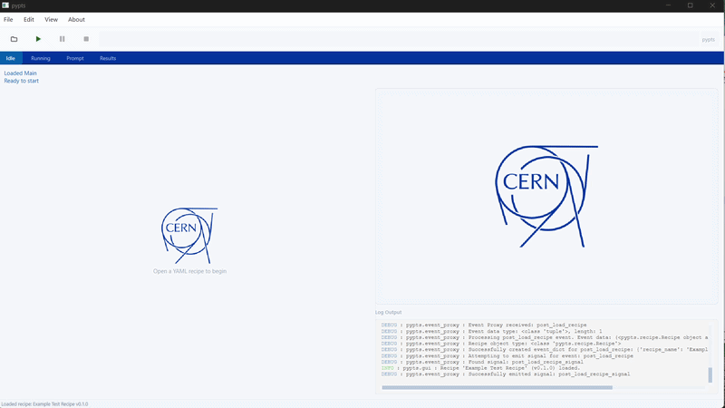

<!--
SPDX-FileCopyrightText: 2025 CERN <home.cern>

SPDX-License-Identifier: CC-BY-SA-4.0
-->

# pypts



Hardware-oriented testing framework developed by BE-CEM-MTA.

## Key Features

*   **YAML-based Recipes:** Define test sequences, steps, parameters, and variables using structured YAML files.
*   **Modular Steps:** Supports various step types including Python function calls, sub-sequence execution, user interaction prompts, wait times, and indexed steps for running tasks multiple times with varying inputs.
    **Reliable order execution:** Unlike pytest-order, the reliably follows the specified order.
*   **Variable Scopes:** Manages global variables for the recipe and local variables within sequences.
*   **Threaded Execution:** Runs recipes in a separate thread using `pts.run_pts`.
*   **Incremental Reporting:** Generates a detailed CSV report (`report.csv`) in real-time as steps complete.
*   **Contextual Reports:** Includes run context (Recipe Name, File Name, Serial Number) and step context (Sequence Name) in reports.
*   **HTML Reports:** Provides a utility to convert the CSV report into a styled HTML file (`report.html`) for easy viewing, similar to `pytest-html`.
*   **Event System:** Uses queues for inter-thread communication and event reporting (e.g., step start/end).

For full documentation, please visit [PTS Framework Documentation](https://acc-py.web.cern.ch/gitlab/pts/framework/pypts/docs/stable/).

=======

## Continuous integration and releases

The project is tested in a disposable Python 3.13 Docker image. To reproduce the
GitHub CI build locally, run:

```sh
docker build --build-arg SETUPTOOLS_SCM_PRETEND_VERSION_FOR_PTS_FRAMEWORK=0+local -t pts-framework-ci .
docker run --rm pts-framework-ci
```

Creating a protected `vX.Y.Z` tag runs the same tests, builds the wheel and source
distribution, and publishes them to TestPyPI. Verify the TestPyPI package in a clean
environment before approving the `pypi` GitHub Environment:

```sh
python -m pip install --index-url https://test.pypi.org/simple/ --extra-index-url https://pypi.org/simple/ pts-framework==X.Y.Z
```

Approval publishes the same distributions to PyPI. GitHub retains the release
artifact for 30 days; PyPI is the permanent package source. See
[release configuration](.github/RELEASE.md) for the one-time setup.

## Licences

pypts is distributed under the **LGPL-2.1-or-later** licence.

pypts comes with a [dependency licence compatibility analysis report](https://acc-py.web.cern.ch/gitlab/pts/framework/pypts/docs/stable/dependency_license_analysis.html).
